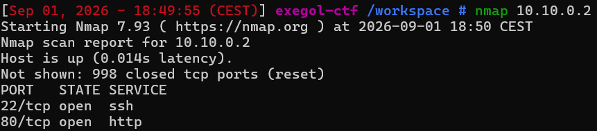
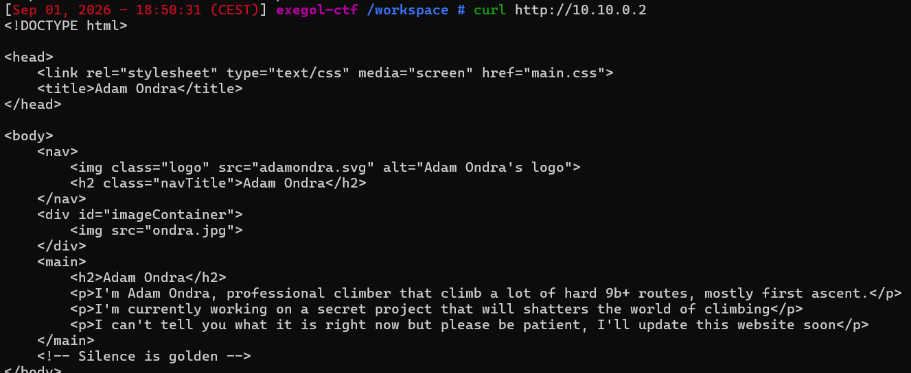
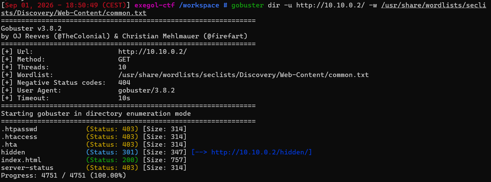
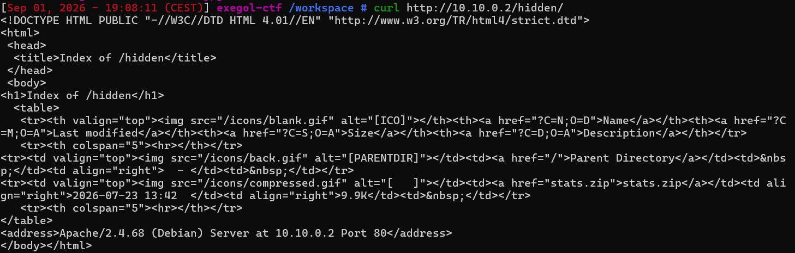
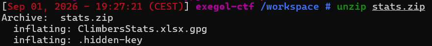
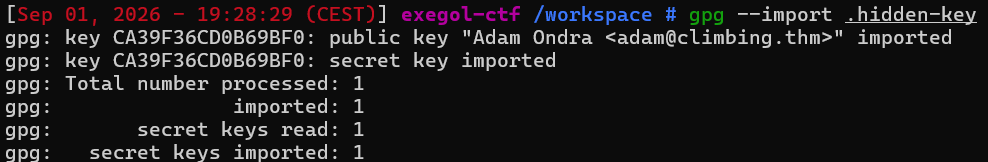
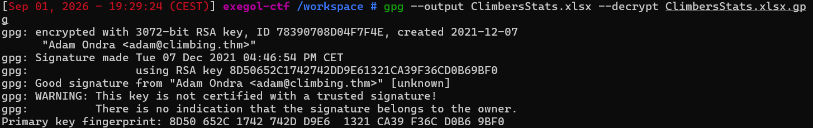
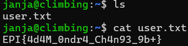

# Silence

Difficulté : Medium

Catégorie : Fuzz

## 1. Reconnaissance

```bash
nmap 10.10.0.2
```



```bash
curl http://10.10.0.2
```



On y voit trois fichiers : main.css, adamondra.svg et ondra.jpg.

## 2. Analyse des fichiers de la page

J'ai récupéré les trois fichiers référencés pour voir s'il y avait quelque chose de caché dedans :

```bash
wget http://10.10.0.2/main.css
wget http://10.10.0.2/adamondra.svg
wget http://10.10.0.2/ondra.jpg
```

En lisant le contenu de main.css et adamondra.svg avec cat, rien d'anormal, juste du code de site classique. J'ai aussi regardé l'image ondra.jpg, mais rien de suspect n'en est ressorti.

## 3. Énumération web

```bash
gobuster dir -u http://10.10.0.2/ -w /usr/share/wordlists/seclists/Discovery/Web-Content/common.txt
```



Gobuster trouve un dossier /hidden/ . En relançant gobuster directement dessus, rien de plus ne ressort. Mais en visitant simplement le dossier avec curl, le serveur affiche directement la liste de son contenu :

```bash
curl http://10.10.0.2/hidden/
```



En allant voir directement dans le dossier /hidden/ avec curl, la page affichait la liste des fichiers qu'il contenait. Il y avait un fichier stats.zip qui avait l'air suspect, je l'ai donc récupéré pour voir ce qu'il y avait dedans.

## 4. Récupération et extraction de l'archive

```bash
wget http://10.10.0.2/hidden/stats.zip
unzip stats.zip
```



L'archive contient deux fichiers :

- ClimbersStats.xlsx.gpg : un fichier Excel chiffré avec GPG
- .hidden-key : un fichier caché

## 5. Déchiffrement avec GPG

```bash
cat .hidden-key
```

Le fichier contient une clé privée PGP. Je l'ai importée dans mon trousseau GPG :

```bash
gpg --import .hidden-key
```



La clé appartient à "Adam Ondra <adam@climbing.thm>". Ensuite j'ai utilisé cette clé pour déchiffrer le fichier Excel :

```bash
gpg --output ClimbersStats.xlsx --decrypt ClimbersStats.xlsx.gpg
```



Le déchiffrement fonctionne directement, sans même demander de mot de passe supplémentaire pour la clé privée.

## 6. Lecture du fichier Excel

```bash
libreoffice --calc ClimbersStats.xlsx
```

Le fichier s'ouvre et affiche un tableau avec trois comptes de grimpeurs, chacun avec un nom d'utilisateur et un mot de passe :


## 7. Connexion SSH et récupération du flag

J'ai testé les comptes du tableau en SSH, celui de janja a fonctionné :

```bash
ssh janja@10.10.0.2
```

Mot de passe : theClimbingMonster

```bash
ls
cat user.txt
```



**Flag : EPI{4d4M_0ndr4_Ch4n93_9b+}**

## Vulnérabilités identifiées

- **Le dossier /hidden/ montrait tout son contenu** : en visitant juste l'adresse du dossier, le serveur affichait la liste de tous les fichiers qu'il contenait, sans demander aucun mot de passe. C'est comme ça que j'ai trouvé stats.zip, alors que je ne connaissais pas son nom à l'avance.
- **Mots de passe en clair dans un fichier Excel** : les identifiants de plusieurs comptes SSH étaient stockés sans aucune protection dans un tableur, protégé seulement par un chiffrement GPG.
- **Clé privée GPG non protégée** : la clé permettant de déchiffrer le fichier sensible n'était protégée par aucun mot de passe, ce qui veut dire que quiconque récupère le fichier .hidden-key peut déchiffrer les données sans effort supplémentaire.

## Comment corriger ça

Désactiver le directory listing sur le serveur web, pour qu'un dossier sans page d'accueil ne révèle jamais la liste de son contenu. Ne jamais stocker de mots de passe en clair dans un fichier, même chiffré, il vaudrait mieux les hacher avant de les stocker, ou utiliser un vrai gestionnaire de secrets. Protéger toute clé privée GPG par une passphrase forte, pour qu'elle reste inutilisable si jamais quelqu'un met la main dessus.

## Ce que j'ai appris

Un fichier .xlsx n'est pas un vrai fichier binaire à l'ancienne, c'est en réalité une archive zip qui contient plusieurs fichiers XML à l'intérieur, ici je l'ai simplement ouvert avec LibreOffice pour le lire plus facilement.

Le directory listing d'un serveur web peut révéler des fichiers qu'aucun scanner automatique comme gobuster ne trouverait, car celui-ci ne teste que les mots d'une wordlist et ne lit jamais vraiment le contenu réel d'une page. Un simple curl manuel sur un dossier reste donc un réflexe important à garder, en plus des outils automatiques.

Une clé privée GPG peut chiffrer/déchiffrer des données, mais elle peut elle-même être protégée par une passphrase, ou pas du tout, comme c'était le cas ici.

Avant de foncer sur une piste compliquée, il vaut mieux d'abord explorer toutes les pistes plus simples et vérifier si elles sont cohérentes avec ce qu'on a déjà vu dans les autres challenges du module.
