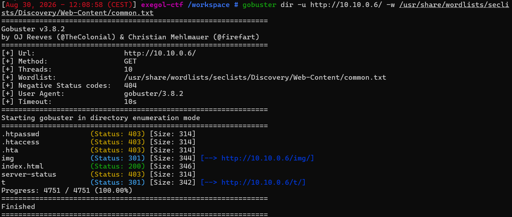
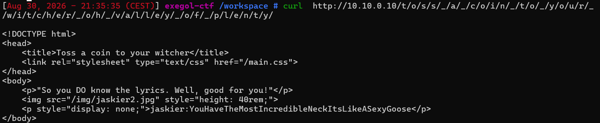
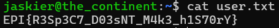

# Toss a Coin

Difficulté : Easy
Catégorie : Fuzz

## 1. Reconnaissance
```bash
nmap 10.10.0.6
```

Deux ports ouverts : 22 (ssh) et 80 (http)

## 2. Énumération web

Un premier gobuster révèle un dossier /t/ :



Ensuite gobuster sur /t/ révèle un sous-dossier o :

```bash
gobuster dir -u http://10.10.0.6/t/ -w /usr/share/wordlists/seclists/Discovery/Web-Content/common.txt
```

En creusant, chaque dossier trouvé contient à son tour un sous-dossier d'une seule lettre /o/. Plutôt que de refaire un gobuster manuel à chaque niveau, j'ai basculé sur ffuf, qui traite les dossiers découverts un par un :

```bash
ffuf -u http://10.10.0.6/t/o/FUZZ -w /usr/share/wordlists/seclists/Discovery/Web-Content/common.txt -recursion
```

En mettant bout à bout toutes les lettres trouvées à chaque niveau, le chemin complet forme une phrase :

```
/t/o/s/s/_/a/_/c/o/i/n/_/t/o/_/y/o/u/r/_/w/i/t/c/h/e/r/_/o/h/_/v/a/l/l/e/y/_/o/f/_/p/l/e/n/t/y/
```

## 3. Découverte des identifiants

Au bout du chemin :

```bash
curl http://10.10.0.6/t/o/s/s/_/a/_/c/o/i/n/_/t/o/_/y/o/u/r/_/w/i/t/c/h/e/r/_/o/h/_/v/a/l/l/e/y/_/o/f/_/p/l/e/n/t/y/
```

```html
    <p style="display: none;">jaskier:YouHaveTheMostIncredibleNeckItsLikeASexyGoose</p>
```



Un <p> en display: none planquait des identifiants en clair dans le code source : jaskier:YouHaveTheMostIncredibleNeckItsLikeASexyGoose.

## 4. Authentification et récupération du flag

Les identifiants trouvés dans le code source fonctionnent directement en SSH :

```bash
ssh jaskier@10.10.0.6
```

Connexion réussie avec le mot de passe : YouHaveTheMostIncredibleNeckItsLikeASexyGoose

Une fois dans le shell, un ls dans le dossier courant révèle user.txt :

```bash
ls
cat user.txt
```

**Flag : EPI{R3Sp3C7_D03snT_M4k3_h1S70rY}**



## Failles trouvées

- **Mot de passe en clair caché dans le HTML** : la page cachait des identifiants SSH valides dans une balise <p style="display: none;">. Le fait que ce soit invisible dans un navigateur ne protège rien, n'importe qui inspectant le code source (ou faisant juste un curl) récupère le texte tel quel. Ça donne un accès direct à un vrai compte SSH.
- **Sécurité par l'obscurité avec les dossiers imbriqués** : le chemin vers la page cachée est protégé uniquement par sa longueur et le fait qu'il ne soit listé nulle part, pas par une vraie authentification. Ça ralentit un attaquant pressé, mais un outil comme ffuf le retrouve sans effort particulier.

## Comment corriger ça

Ne jamais stocker le moindre secret (mot de passe, clé, etc.) dans du code envoyé au client, même caché visuellement ou dans un commentaire. Si un chemin doit rester confidentiel, il faut une vraie authentification derrière, pas juste un nom de dossier imprévisible.

## Ce que j'ai appris

Passer de gobuster à ffuf avec l'option -recursion permet d'automatiser la découverte sur plusieurs niveaux de dossiers, plutôt que de relancer un scan manuellement à chaque nouveau dossier trouvé. Ça fait gagner beaucoup de temps quand la structure est profonde comme ici, mais ça envoie aussi beaucoup plus de requêtes d'un coup.

Une page qui répond avec un contenu différent (ici un texte caché en display:none) mérite toujours d'être inspectée en curl brut plutôt que seulement dans un navigateur, pour voir tout ce qui est réellement envoyé par le serveur.