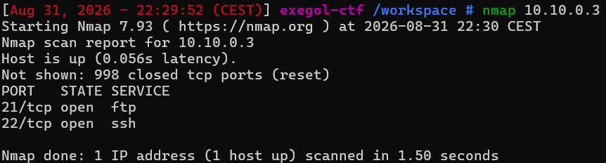
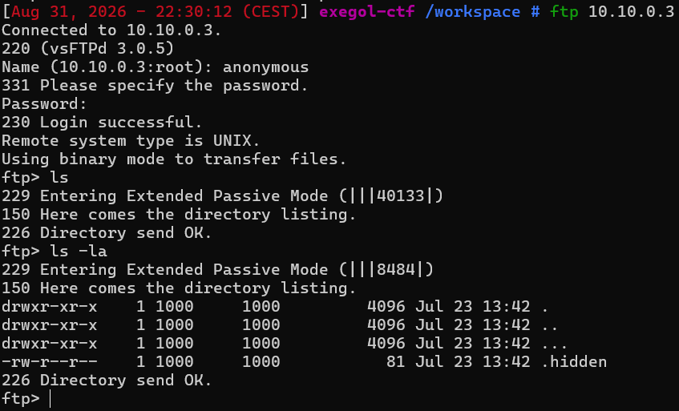
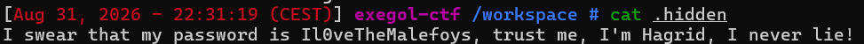
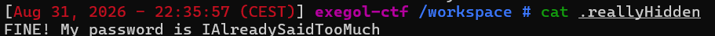
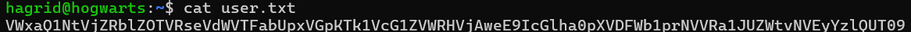

# Yer a Wizard

Difficulté : Easy
Catégorie : Cracking

## 1. Scan de la machine

```bash
nmap 10.10.0.3
```



J'ai quand même essayé une requête HTTP au cas où, ça donne "Connection refused", confirmé aussi par des scans ffuf/gobuster sur le port 80 qui échouent pareil. Donc pas de site web ici, je me concentre sur FTP et SSH.

## 2. Regarder le service FTP

```bash
ftp 10.10.0.3
Name: anonymous
Password:
ls -la
```



Normalement, un dossier contient toujours . et .. en plus des vrais fichiers/dossiers, ce que je ne savais pas au début et j'ai pris du temps à savoir. Ici il y a une troisième ligne : .... Ce n'est pas une entrée spéciale du système, juste un dossier normal nommé avec trois points pour se fondre avec . et ..

## 3. Trouver les mots de passe

```bash
get .hidden
cat .hidden
```



Ce message insiste beaucoup trop sur le fait d'être vrai ("je jure", "je ne mens jamais"). Ça sent le piège, un peu comme le message codé qui menait nulle part sur le challenge H4ck3rz. J'ai essayé la connexion en ssh avec ce mot de passe mais ça n'a pas fonctionné.

Je vais voir le dossier caché `...` trouvé avant :

```bash
cd ...
ls -la
cat .reallyHidden
```



## 4. Se connecter en SSH

```bash
ssh hagrid@10.10.0.3
Password: IAlreadySaidTooMuch
```

Ça marche avec le nom d'utilisateur en minuscule (hagrid) et le deuxième mot de passe trouvé.

## 5. Récupérer et décoder le flag

```bash
ls -la
cat user.txt
```



Le contenu de user.txt ressemble à du base64 (que des lettres, chiffres, + / =). Je l'ai décodé sur Cyber Swiss Army Knife, et le résultat était encore du base64. Il a fallu décoder 3 fois de suite avant d'avoir le flag :

"VWxaQ1NtVjZRblZOTVRseVdWVTFabUpxVGpKTk1VcG1ZVWRHVjAweE9IcGlha0pXVDFWb1prNVVRa1JUZWtvNVEyYzlQUT09"
Résultat = UlZCSmV6QnVNMTlyWVU1ZmJqTjJNMUpmYUdGV00xOHpiakJWT1VoZk5UQkRTeko5Q2c9PQ==

"UlZCSmV6QnVNMTlyWVU1ZmJqTjJNMUpmYUdGV00xOHpiakJWT1VoZk5UQkRTeko5Q2c9PQ=="
Résultat = RVBJezBuM19rYU5fbjN2M1JfaGFWM18zbjBVOUhfNTBDSzJ9Cg==

"RVBJezBuM19rYU5fbjN2M1JfaGFWM18zbjBVOUhfNTBDSzJ9Cg=="
Résultat = EPI{0n3_kaN_n3v3R_haV3_3n0U9H_50CK2}

**Flag : EPI{0n3_kaN_n3v3R_haV3_3n0U9H_50CK2}**

## Failles trouvées

- **FTP anonyme trop permissif** : n'importe qui peut se connecter sans vrai compte, et même sans vrai mot de passe. Ça m'a permis de récupérer deux mots de passe sans aucune authentification.
- **Mot de passe en clair dans un fichier** : le vrai mot de passe du compte SSH était juste écrit dans un fichier texte, accessible via le FTP anonyme.
- **Flag "protégé" juste par de l'encodage** : le base64 n'est pas un chiffrement, il n'y a pas de clé ni de mot de passe pour le décoder, juste un format à reconnaître.

## Comment corriger ça

Désactiver l'accès FTP anonyme. Il ne faut jamais laisser un mot de passe réel en clair dans un fichier, même caché dans un dossier difficile à trouver. Ne pas confondre encoder une donnée avec la protéger réellement.

## Ce que j'ai appris

Le premier caractère d'un ls -la (d) dit que c'est un dossier, mais ça ne suffit pas toujours à repérer un piège : ici, ., .. et ... ont exactement le même d et les mêmes permissions. Ce qui trahit ... comme un vrai dossier caché, c'est uniquement son nom, qui n'est pas une entrée spéciale du système comme . et ..

Une chaîne encodée en base64 se reconnaît à son alphabet particulier (lettres, chiffres, +, /, =). Quand le résultat d'un décodage ressemble encore à ça, il faut redécoder encore, jusqu'à tomber sur du texte lisible.
